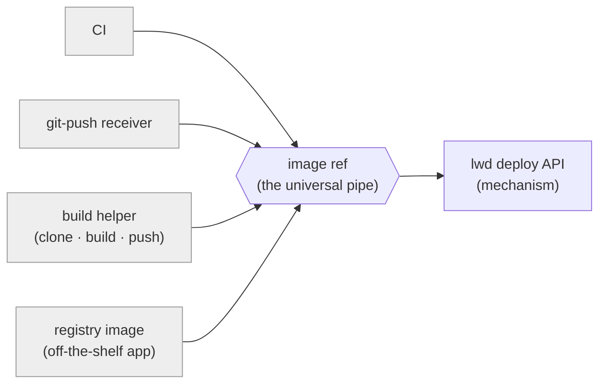
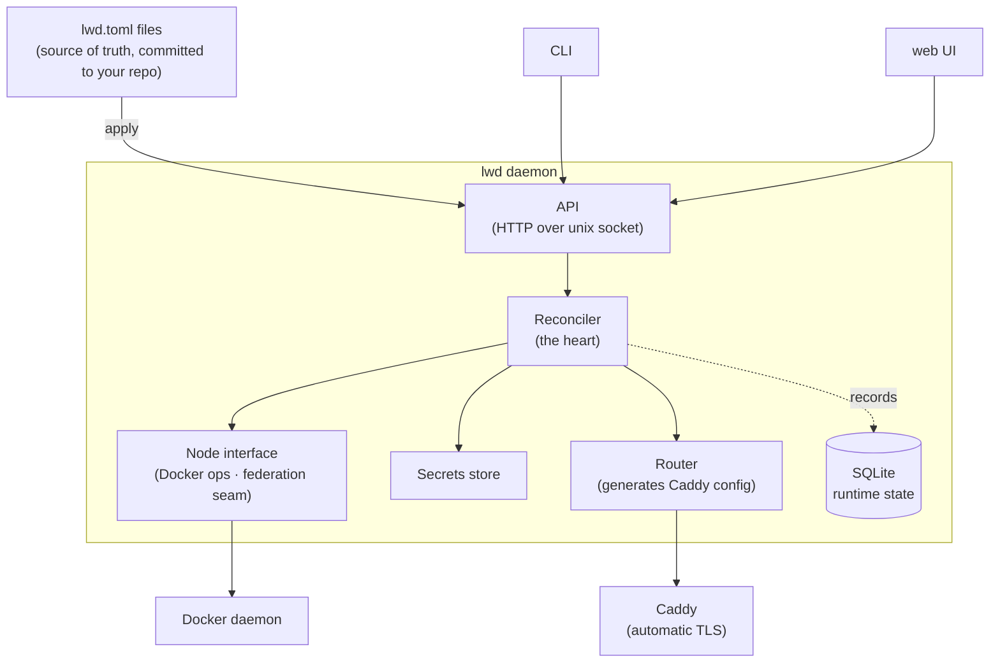
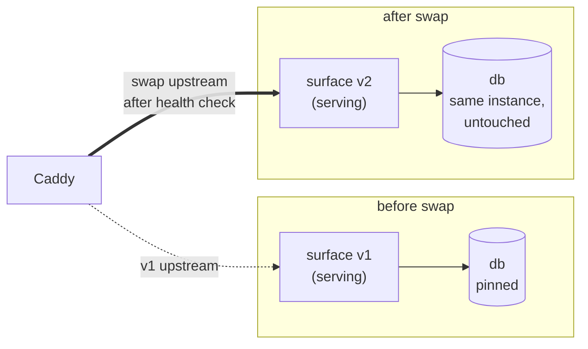
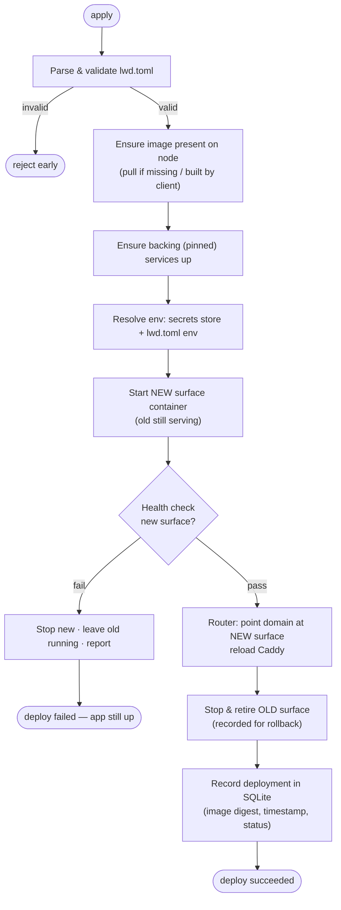

# lwd — lightweight deploy

**Status:** Design (approved in brainstorming, pending spec review)
**Date:** 2026-07-03

## What it is

`lwd` ("lightweight deploy") is a self-hosted deployment engine with a web UI for
running Docker apps on your own server. Think "self-hosted Vercel," or a suckless
Coolify: point it at an app, get an HTTPS URL, deploy with one command, roll back
with one command.

The guiding constraint is the Unix philosophy: do one thing well, compose with
existing tools instead of reinventing them, keep the core small and testable, and
make configuration plain text you can read and edit by hand.

## Scope

**In scope (now):**
- Single host. lwd runs on one box and deploys to that box's Docker.
- Three input shapes: pre-built registry images, build-from-source (Dockerfile),
  and Docker Compose stacks.
- Declarative config as the source of truth (`lwd.toml`, committed to your repo).
- Automatic HTTPS + domain routing (via Caddy).
- Health-gated, zero-downtime blue-green deploys for stateless surfaces.
- Rollback, deployment history, live logs.
- Daemon-held secrets store.
- Thin embedded web UI + a CLI, both clients of one HTTP API.

**Explicitly out of scope:**
- Multi-host scheduling / fleet orchestration (Nomad/Swarm/k8s territory).
- Autoscaling and multi-replica load balancing beyond what Caddy gives you.
- A persistent "build server" — building is an event (a command), not a service.

**Federation-ready, not federated.** We build single-host now but keep three seams
correct so multi-host can be added later without a rewrite (see "Federation seams").

## Core principle: mechanism vs policy

lwd is the **mechanism**: run this image, route it, secure it, health-check it,
keep the previous version for rollback. *How an image comes to exist* — CI, a
git-push receiver, a build helper — is **policy** that lives in small clients on
top of lwd's API. The core does not know or care where an image came from. That
ignorance is what keeps it small, testable, and useful on day one with nothing but
pre-built images.

The build/deploy split rides on the standard interface that already exists — an
**OCI image reference**. Build's output is an image ref; deploy's input is an image
ref. The "pipe" between them is the local Docker image store (single host today),
or later a registry / `docker save | ssh | docker load`. We never invent a custom
handoff protocol.



Everything on the left is *policy* and optional; only lwd (the mechanism) is core.

## Architecture

One daemon + one CLI + one embedded web UI, sharing a single HTTP API over a unix
socket. Internally, a few single-purpose units with clean seams:



### Units and their single responsibility

- **API** — thin HTTP layer over a unix socket. CLI and web UI are both just
  clients. No business logic lives here.
- **Reconciler** — the heart. Given a desired app spec (parsed `lwd.toml`), it makes
  reality match: ensure image present → deploy surfaces (blue-green) → ensure
  backing services up → update routing → record history. Idempotent.
- **Node interface** — the primary federation seam. All Docker operations go through
  it. One implementation today: `localDocker`. It deals only in image refs and
  container ops; it never assumes locality.
- **Workload concept** — an app is composed of *surfaces* (stateless, blue-greened)
  and *pinned* backing services (stateful, left running). See "Surfaces vs backing."
- **Secrets store** — `lwd secret set` writes here (in the daemon data dir). Injected
  as env at container start. Never in the repo.
- **Router** — owns the generated Caddy config; regenerates + reloads on change.
  Maps domain → current surface container. Caddy provides automatic Let's Encrypt TLS.
- **State (SQLite)** — *runtime* state only: deployment history, current/previous
  container per app, status, secrets. App *definitions* live in the `lwd.toml` files,
  not here. The DB is derived and largely disposable.

**Language: Go.** Single static binary (daemon + CLI + embedded UI assets) you
`scp` to a server and run under systemd. First-class Docker SDK, same ecosystem as
Caddy.

### Discipline

The Reconciler and Node interface know nothing about git, builds, or the web UI.
Those are upstream clients that produce an image ref + spec and call the API.

## Surfaces vs backing services

The central distinction that makes blue-green tractable without tearing apart state.

- A service is either a **surface** (stateless code that changes each deploy → gets
  blue-green) or **pinned** (stateful, long-lived — Postgres, Redis, a volume →
  started once, left running across deploys, never ripped apart).
- **Blue-green only ever touches surfaces.** Backing services keep running; both the
  old and new surface connect to the same untouched backing service over the
  project network by service name.
- **Safe default: pinned.** A service is only blue-greened if you explicitly list it
  as a surface. You can never accidentally double-run a stateful service.

Mechanically this collapses to **one deploy mechanism + a pinned-infra concept**:

- **Surfaces** are always deployed the same clean way — lwd runs them directly via
  the Node interface and blue-greens them. Always zero-downtime, whether or not
  there's a database behind them.
- **Backing services** are brought up once (via `docker compose` or a pinned
  container) on a shared network; lwd ensures they're up and reconciles them only
  if their definition actually changes (and loudly, because state is at stake).

During a deploy, the surface is swapped while the backing service stays put — both
old and new surface reach it over the same project network:



Surfaces are stateless *by contract*, so nothing stops you from later pulling a
backing service out into its own long-lived resource (the 12-factor "attached
resource" model) — same design, just a different file boundary. That variant is the
best fit for eventual federation (stateless surfaces roam; the db stays pinned to
its node with its volume) but is not required now.

## Deploy lifecycle

A deploy is one idempotent reconcile pass. Triggered by `lwd apply <dir>`, the web
UI "Deploy" button, or any API client (e.g. a git-push receiver).



**Properties:**
- **Atomic.** A broken deploy never takes the app down; it just doesn't switch over.
- **Zero-downtime for surfaces.** New must pass health before old is touched.
- **Rollback needs no rebuild.** Previous good deployment = recorded image digest +
  spec. `lwd rollback <app>` re-runs reconcile against the previous digest. Keying on
  digests makes rollback exact.
- **Idempotent.** Re-applying an unchanged spec is a no-op (same digest + config →
  nothing to do). This is what makes it a reconciler, not a script.

## Config: `lwd.toml`

The whole contract for an app, hand-writable in ~30 seconds.

Single-service app:

```toml
name = "blog"
image = "ghcr.io/me/blog:latest"   # or omit + use [build] below
domain = "blog.example.com"        # Caddy routes + TLS automatically
port = 8080                        # container port to route to
node = "local"                     # federation seam; defaults to local

env = { LOG_LEVEL = "info" }       # non-secret config only
secrets = ["DATABASE_URL"]         # names; values come from the secret store

[health]
path = "/healthz"                  # HTTP 200 = healthy; else TCP connect check
timeout = "30s"

[build]                            # OPTIONAL — presence means "build from source"
context = "."                      # handed to a build client, not the core
dockerfile = "Dockerfile"
```

Compose app (with surface/backing split):

```toml
name = "webapp"
compose = "docker-compose.yml"     # defines the whole stack incl. db
surfaces = ["web", "worker"]       # ONLY these get blue-greened
                                   # unlisted services (db, redis) = pinned
domain = "webapp.example.com"
service = "web"                    # which surface Caddy fronts
port = 8080

[health]
path = "/healthz"
```

## CLI

`lwd` talks to the daemon over the unix socket.

```
lwd apply <dir>            reconcile app(s) to spec
lwd ls                     list apps + status
lwd logs <app> [-f]        stream container logs
lwd rollback <app>         revert to previous good deployment
lwd secret set <app> KEY=val
lwd rm <app>               stop + deregister
lwd daemon                 run the daemon (systemd unit in practice)
```

## Web UI

Served from the same binary, a client of the same API. Deliberately thin — a view
and editor over files and live state, never a hidden source of truth.

- Dashboard: apps, status, current image/digest, domain, health.
- Per-app: live logs, deployment history, one-click rollback, edit env/secrets.
- Edit `lwd.toml` in-browser and apply.

## Data layout

Data dir defaults to `/var/lib/lwd/`:

```
/var/lib/lwd/
  lwd.db          SQLite — runtime state (history, status, secrets)
  secrets/        secret material
  Caddyfile       generated router config
```

App definitions live wherever you keep them (a git repo), not in the data dir.

## Build-from-source (a client, not the core)

When `[build]` is present, a thin build helper clones/builds/pushes and calls the
deploy API with the resulting image digest. It is just another API client — the
same API CI or a git-push receiver would call. Multi-image builds are Compose's
department (`docker compose build`); lwd's own `[build]` block stays single-image.

## Federation seams (build now, use later)

Three decisions, zero extra code today, no rewrite later:

1. **Talk to Docker through the Node interface, never assume "local."** The core
   issues node operations against a `Node` abstraction. One node (`local`) today.
   Federation = a second implementation that's an RPC to a remote agent.
2. **Image availability is a precondition, not an assumption.** The core says
   "ensure this image ref is present on the target node," never "the image is local."
   No-op / local build today; pull-from-registry or `save|load` later.
3. **Every app carries a target `node` in the model,** always `local` today. Single-
   host never leaks into the schema.

## Error handling

- Failed deploys never touch the running app (health-gated swap).
- The reconciler is idempotent, so retry is always safe.
- Bad specs are rejected at parse/validate before anything runs.

## Testing strategy

The Node interface being an interface means the whole reconciler is testable against
a fake node with zero Docker — the core reason that seam exists. Router config
generation and `lwd.toml` parsing/validation are pure and unit-testable. Integration
tests exercise the real local Docker path.

## Non-goals recap

No fleet scheduling, no autoscaling, no build server, no reimplementation of Compose,
no hidden DB source of truth. Lightweight means the core stays small and delegates.
