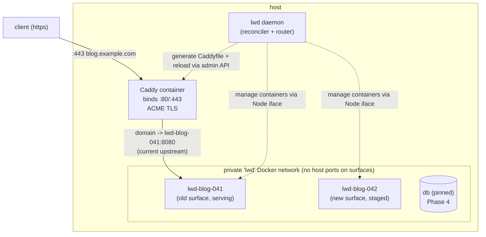
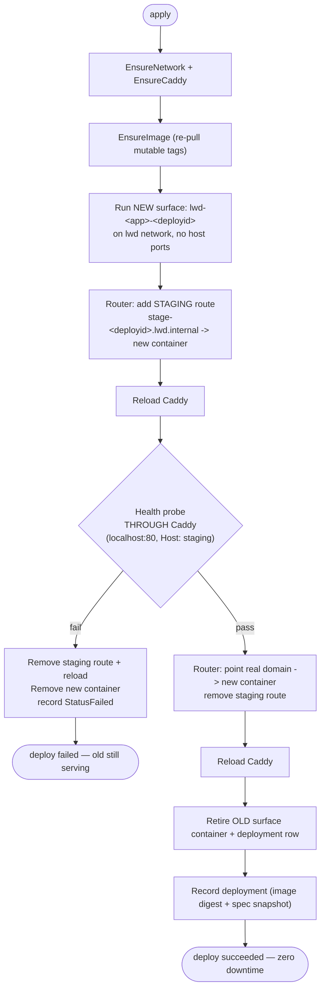

# lwd Phase 2 — router, TLS, blue-green, rollback

**Status:** Design (draft — four decisions assumed pending user confirmation; see "Open decisions")
**Date:** 2026-07-03
**Builds on:** Phase 1 core-deploy (merged). Prior design: `2026-07-03-lwd-design.md`.

## Goal

Turn lwd from "runs a container, reachable by host port" into "self-hosted Vercel":
every app gets an HTTPS URL at its domain, and deploys are zero-downtime with a
one-command rollback.

Phase 2 delivers: a private Docker network + Caddy reverse proxy (automatic TLS),
health-gated **blue-green** swap for stateless surfaces, and `lwd rollback`.

## The forcing constraint

Blue-green requires the **old and new container of the same app to run
simultaneously** (start new → health-check → cut over → retire old). Phase 1
published each container's port to the identical host port. Two containers cannot
bind the same host port, so that model cannot support blue-green.

**Resolution: stop publishing host ports. Route everything through Caddy over a
private Docker network.** This also retires Phase 1's host-port-collision
limitation (two apps both wanting 8080).

## Architecture shift

- lwd creates a dedicated **`lwd` Docker network**.
- **Surface containers join it and publish no host ports.** Reachable only by
  container name on the network.
- **Caddy runs as a container** lwd manages (pinned system container), attached to
  the `lwd` network, binding `:80`/`:443` on the host. lwd configures it by
  generating a **Caddyfile** and reloading via Caddy's **admin API** (bound to
  `127.0.0.1:2019`, or an internal address).
- Caddy proxies `domain → <current-surface-container>:<port>` over the network.

Running Caddy as a container (rather than embedding it in the binary or requiring
the user to run it) is what makes routing work identically on Linux servers and on
Docker Desktop: a host-side proxy cannot reach container IPs on Docker Desktop, but
a proxy *on the network* can. It also reuses lwd's existing container machinery —
Caddy is just a special always-on container lwd owns.

## New / changed components

- **Router** (`internal/router`) — new. Owns the generated Caddyfile and the Caddy
  container's lifecycle: `EnsureCaddy(ctx)` (pull + run + join network if not
  running), `SetUpstream(ctx, domain, containerName, port)`, `RemoveUpstream(ctx, domain)`,
  and `Reload(ctx)` (write Caddyfile, POST to admin API). Generates plain-text
  Caddyfile from the set of active app→container routes.
- **Node interface** (`internal/node`) — extended. `RunContainer` gains network
  attachment and no longer publishes host ports for surfaces; add
  `EnsureNetwork(ctx, name)` and `ContainerIP`/name resolution as needed. The Caddy
  container is created here too (it's just a container). The `Node` interface stays
  the federation seam — remote nodes will implement the same network/route ops.
- **Reconciler** (`internal/reconciler`) — reworked deploy path from recreate to
  blue-green (see below).
- **Store** (`internal/store`) — add a **spec snapshot** (JSON) column per
  deployment so rollback restores the exact prior image *and* config. Add
  `PreviousDeployment(app)` and `DeploymentsForApp(app)` queries.
- **API + CLI** — add `POST /apps/{name}/rollback` → `lwd rollback <app>`, and
  surface deployment history in `lwd ls`/a new `lwd history <app>`.

## Deploy lifecycle (blue-green)

Key properties (upgraded from Phase 1's recreate):
- **Zero-downtime.** The old container serves continuously until Caddy is flipped to
  a proven-healthy new one.
- **Atomic.** A failed health probe removes the staging route and the new container;
  the domain never points anywhere but a healthy container.
- **Idempotent.** Re-applying an unchanged spec (same digest + config) is a no-op.

## Health check — layered fallback, probed through Caddy

With host ports gone, the daemon (on the host) generally cannot reach a surface
container directly (notably on Docker Desktop). All HTTP probing therefore goes
**through the Caddy container** (host → `127.0.0.1:80` → container over the network),
which is portable and needs no `curl`/`wget` inside the app image. The mechanism:
lwd adds a temporary **staging route** (`stage-<deployid>.lwd.internal →
<new-container>:<port>`), reloads Caddy, probes via `GET http://127.0.0.1:80<path>`
with `Host: stage-<deployid>.lwd.internal`, then either flips the real domain (on
pass) or drops the staging route and removes the container (on fail).

Because custom software often declares no health information at all, lwd resolves
health in a **layered fallback**, so *something* sensible always gates the cutover:

1. **`[health] path` declared → strict readiness.** GET the path through Caddy;
   require HTTP **2xx**. (Encouraged in docs — this is the only true readiness gate.)
2. **No path, but the image defines a Docker `HEALTHCHECK` → honor it.** Poll the
   container's Docker health status (`State.Health.Status`) until `healthy` or
   timeout. Respects image authors who declared one; entirely optional.
3. **Neither → liveness fallback.** The container must stay `running` through a short
   settle window (i.e. not crash-loop) **and** answer a request through Caddy — any
   response that is *not* a Caddy-generated 502/503 (bad gateway) proves the app is
   listening and accepting connections.

Only layer 2 touches Docker health metadata, and its absence simply falls through to
layer 3 — lwd never *requires* a Docker `HEALTHCHECK`. Health is coupled to Caddy
being up, which is acceptable since routing is the point of this phase and
`EnsureCaddy` runs first. A new `node` method exposes container run-state + Docker
health status (`ContainerHealth(ctx, id) (state string, dockerHealth string, err error)`)
to drive layers 2 and 3.

## Rollback

- Each deployment stores a **spec snapshot** (the resolved `spec.App` as JSON) plus
  the image digest.
- `lwd rollback <app>` loads the previous *successful* deployment's snapshot and runs
  the same blue-green `Apply` against that snapshot's image digest + config. Because
  it reuses the deploy path, rollback is itself zero-downtime and health-gated.
- `lwd history <app>` lists deployments (id, image digest, status, timestamp).

## TLS

Caddy handles TLS automatically. Default behavior:
- **Public/resolvable domain →** Let's Encrypt (ACME) certificates.
- **Local/`.localhost`/non-resolvable domain →** Caddy `internal` (self-signed) certs,
  so local dev "just works" without cert issuance failures.

lwd chooses per-domain when generating the Caddyfile.

## Data flow / interfaces (summary)

- `router.Router` depends only on `node.Node` (to run/inspect the Caddy container)
  and its own Caddyfile generation. It exposes upstream mutations + reload; it holds
  no app logic.
- `reconciler` orchestrates: node (run/remove/network), router (stage/flip/reload),
  store (snapshot/history). Still fully testable against the fake node + a fake/real
  router.
- The Caddyfile is the inspectable source of routing truth on disk
  (`/var/lib/lwd/Caddyfile`), regenerated from active routes on every change.

## Error handling

- `EnsureCaddy`/`EnsureNetwork` failures abort the deploy before touching the running
  app.
- A failed staging probe never affects the live domain (old container keeps serving).
- Caddy reload failure after a flip is the one risky window: mitigate by validating
  the generated Caddyfile (`caddy validate` / admin API returns error) *before*
  committing the flip, and keeping the previous Caddyfile to restore on reload error.

## Testing strategy

- Router Caddyfile generation is pure → unit-tested (routes in → Caddyfile text out).
- Reconciler blue-green orchestration → tested against the fake node + a fake router,
  asserting ordering (stage → probe → flip → retire) and the failure path (probe fail
  → new container removed, domain untouched).
- Store snapshot + history queries → unit-tested with a temp DB.
- Integration/e2e (guarded by `LWD_DOCKER_TEST`): real Caddy container + real app
  container, deploy twice, assert the HTTPS/HTTP endpoint stays served across the swap
  and that `rollback` restores the prior version.

## Out of scope (later phases)

Secrets injection (Phase 3), compose apps + surfaces/pinned backing services
(Phase 4), web UI (Phase 5). Multi-node federation remains deferred; the network +
router ops are added to the `Node`/router seams so a remote node can implement them
later.

## Decisions (resolved with the user)

1. **Caddy lifecycle:** **managed container.** Chosen deliberately as the more
   suckless option — lwd composes Caddy rather than embedding a web server (which
   would bloat the binary and pull ACME/HTTP/TLS code into lwd's surface). Cost is
   one image + one process, the irreducible price of automatic HTTPS routing.
2. **Health-check mechanism:** **layered fallback, probed through Caddy** —
   `[health] path` (2xx) → honor Docker `HEALTHCHECK` if present → liveness+listening
   fallback. Does not depend on a Docker `HEALTHCHECK` existing.
3. **Rollback scope:** **in Phase 2.**
4. **Local TLS:** **auto** — Let's Encrypt for public/resolvable domains, Caddy
   `internal` (self-signed) certs for local/`.localhost`/non-resolvable domains.
