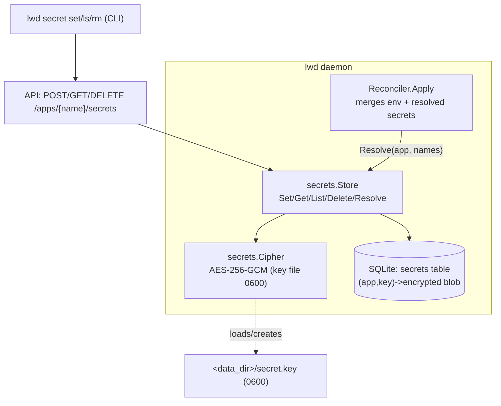

# lwd Phase 3 — secrets

**Status:** Design (decisions resolved with the user)
**Date:** 2026-07-03
**Builds on:** Phase 1 (core deploy) + Phase 2 (router/blue-green), both merged.
**Prior design:** `2026-07-03-lwd-design.md` (Phase 3 = the deferred secrets store).

## Goal

Let `lwd.toml` declare `secrets = ["DATABASE_URL"]` (names only, committed to git)
while the actual values live only on the server, encrypted at rest, and are injected
as environment variables at container start. Set values with `lwd secret set`; they
never appear in the repo and are never read back out of the daemon.

## Decisions (resolved)

1. **Encryption at rest:** values are encrypted with a **local key file** (`0600`) in
   the data dir, using AES-256-GCM (Go stdlib — no new dependency, no cgo). Protects
   the SQLite DB, backups, and snapshots if they leak. Honest threat model: it does
   **not** protect against an attacker who already has root on the host (the key sits
   in the same data dir). Documented as such.
2. **Missing secret at deploy:** **fail-closed** — a declared-but-unset secret aborts
   the deploy with a clear error, leaving any running version untouched (same
   isolation as a failed health check). An app never starts silently missing a secret.
3. **`lwd secret set`:** reads the value from **stdin** (keeps it out of shell history
   and `ps`), stores it, and prints a "redeploy to apply" hint. It does **not**
   auto-redeploy — env only binds at container start, and a `set` that restarts your
   app would be surprising.

## Core principle

Secret **values** enter the daemon once (over the local `0600` unix socket) and never
leave it. The API and CLI can set, list (names only), and delete — there is **no
get-value endpoint**. Resolution happens entirely inside the daemon: the reconciler
asks the secret store for values at deploy time, in-process. Values cross the socket
inbound only.

## Components

- **`internal/secrets/cipher.go`** — key management + crypto. `NewCipher(keyPath string)`
  loads the 32-byte key at `keyPath`, generating it with `crypto/rand` and writing it
  `0600` if absent. `Encrypt(plaintext []byte) ([]byte, error)` / `Decrypt(blob []byte)
  ([]byte, error)` using AES-256-GCM with a random 12-byte nonce prepended to the
  ciphertext. Pure and unit-testable against a temp key file.
- **`internal/store`** — add a `secrets` table `(app TEXT, key TEXT, value BLOB NOT NULL,
  PRIMARY KEY(app,key))` storing **encrypted** blobs (the store never sees plaintext):
  `SetSecret(app,key string, enc []byte)`, `GetSecret(app,key string) ([]byte, error)`
  (nil when absent), `ListSecretKeys(app string) ([]string, error)` (sorted),
  `DeleteSecret(app,key string) error`. Migration via `CREATE TABLE IF NOT EXISTS`
  (naturally idempotent, safe on existing DBs).
- **`internal/secrets/store.go`** — `Store` combining cipher + `*store.Store`:
  `Set(app,key,value string) error`, `Get(app,key string) (string, bool, error)`,
  `List(app string) ([]string, error)`, `Delete(app,key string) error`, and
  `Resolve(app string, names []string) (map[string]string, error)` which returns an
  error naming any missing secret (**fail-closed**).
- **Reconciler** — `New` gains a resolver dependency behind an interface
  `SecretResolver interface { Resolve(app string, names []string) (map[string]string, error) }`
  (so the reconciler stays testable with a fake). In `Apply`, after building env from
  `app.Env`, resolve `app.Secrets` and merge (secret values win on key collision). A
  `Resolve` error aborts the deploy before the new container starts — the running
  version keeps serving (record `StatusFailed`, return error).
- **API** — `POST /apps/{name}/secrets` (body `{"key":...,"value":...}` → set),
  `GET /apps/{name}/secrets` (→ `["KEY1","KEY2"]` names only), `DELETE
  /apps/{name}/secrets/{key}`. No value is ever returned.
- **Client + CLI** — `lwd secret set <app> <KEY>` (reads value from stdin; prints
  "secret KEY set for <app>; redeploy to apply"), `lwd secret ls <app>` (names only),
  `lwd secret rm <app> <KEY>`.

## Deploy interplay

Secrets take effect on the next deploy. `Apply` (unchanged blue-green flow) builds the
new container's env as `merge(app.Env, resolve(app.Secrets))`; a resolve failure is a
pre-start abort, so blue-green's guarantee holds — a missing/unresolvable secret never
takes the live app down.

## Error handling

- Missing key file → generated on first use (`0600`); a key file with wrong size or
  unreadable → clear startup/first-use error.
- Decrypt failure (corrupt/tampered blob, or wrong key) → error surfaced, deploy
  fails closed rather than injecting garbage.
- `Resolve` with any unset declared secret → error listing the missing name(s); deploy
  aborts.
- Setting a secret for a value that already exists overwrites it (upsert).

## Security notes (documented in README)

- Values are encrypted at rest (AES-256-GCM); the key file is `0600` in the data dir.
  This protects the DB/backups, **not** against root on the host.
- Values never leave the daemon: no get-value API, `ls` returns names only, `set`
  reads from stdin.
- The unix socket is already `0600`; values transit it inbound in plaintext locally.

## Testing strategy

- `cipher`: round-trip encrypt/decrypt against a temp key file; a fresh key file is
  generated `0600`; decrypt of a tampered blob errors; two ciphertexts of the same
  plaintext differ (random nonce).
- `store`: set/get/list/delete of encrypted blobs; list sorted + names only; migration
  idempotent across reopens.
- `secrets.Store`: `Resolve` returns all values when present; errors naming the missing
  one when any is absent (fail-closed); `Get`/`List` never expose other apps' keys.
- `reconciler`: with a fake resolver, `Apply` merges resolved secrets into container
  env (assert via the fake node's captured `RunSpec.Env`), secrets override `env` on
  collision, and a resolver error aborts the deploy leaving the old version running.
- `api`: set → list shows the name (never the value); delete removes it; GET never
  returns values.

## Out of scope (later / deferred)

- Global/shared secrets across apps (per-app only for now).
- Secret rotation workflows, external secret managers (Vault, cloud KMS).
- Compose apps + surfaces/pinned (Phase 4), web UI (Phase 5), multi-node.
