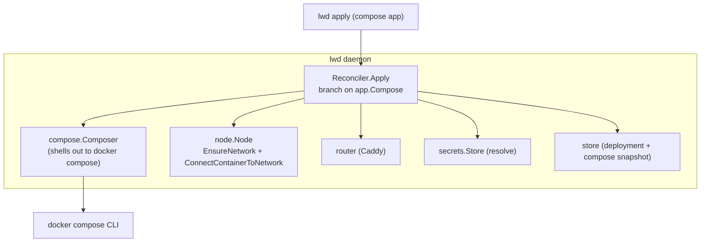

# lwd Phase 4 — compose apps

**Status:** Design (decisions resolved with the user)
**Date:** 2026-07-04
**Builds on:** Phases 1–3 (all merged).
**Prior design:** `2026-07-03-lwd-design.md` (surfaces/pinned discussion).

## Goal

Let an `lwd.toml` app be a multi-container **Docker Compose** stack (app + worker +
db + redis…) instead of a single image. lwd delegates orchestration to
`docker compose` and layers its Caddy routing + TLS + health-gating on top. Single-
service `image` apps are unchanged.

## Decisions (resolved)

1. **Deploy model: delegate to compose, in-place recreate.** lwd runs
   `docker compose -p lwd-<app> up -d` for the whole stack. Compose only recreates
   services whose image/config changed, so **the database (unchanged) stays up** —
   which was the main point of the surfaces/pinned split. lwd routes the declared web
   service through Caddy and health-checks it. This is **not** blue-green: the web
   service gets a brief in-place restart on redeploy, and a failed health check means
   the (possibly broken) new stack is live until fixed or rolled back. Blue-green
   stays reserved for single-service `image` apps where it's clean. The full
   surfaces-outside-compose machinery is deliberately **not** built (YAGNI for now).
2. **Env + secrets → compose environment.** lwd resolves `env` + declared `secrets`
   (fail-closed on a missing secret, same as single-service) and passes them as
   **environment variables to the `docker compose` process**, so the compose file's
   `${VAR}` interpolation and service `environment:` entries pick them up. Secret
   values stay in the daemon's encrypted store and never touch disk as a project file.
3. **Phase 5** (web UI) gets its own brainstorm after this merges.

## Requirement

Compose apps require the **`docker compose` CLI plugin** on the host (Docker Desktop
and modern Docker Engine ship it). Single-service apps do not. Documented in README.

## Config

```toml
name    = "webapp"
compose = "docker-compose.yml"   # relative to the app dir
service = "web"                  # the compose service Caddy fronts
domain  = "webapp.example.com"
port    = 8080                   # container port of `service`
env     = { LOG_LEVEL = "info" } # passed to compose as environment
secrets = ["DATABASE_URL"]       # resolved + passed to compose as environment
```

Validation: a compose app requires `compose`, `service`, `domain`, `port`, and must
**not** also set `image` or `[build]`. A single-service app is unchanged (`image` +
`port`). The `surfaces` field is **not** used in the delegate model and remains
rejected. `node` still defaults to `local`.

## Architecture



- **`internal/compose`** — a `Composer` interface + a real CLI impl that shells out to
  `docker compose` and a `FakeComposer` for tests:
  - `Up(ctx, spec UpSpec) error` — `docker compose -p <project> -f <file> up -d
    --remove-orphans`, with `spec.Env` set on the process environment.
  - `Down(ctx, project, file string) error` — `docker compose -p <project> -f <file>
    down`.
  - `ServiceContainer(ctx, project, service string) (id, name string, err error)` —
    resolves the running container for a service (`docker compose -p <project> ps -q
    <service>` + inspect for the name).
  - `UpSpec{ Project, File string, Env map[string]string }`.
- **`internal/node`** — add `ConnectContainerToNetwork(ctx, containerID, network
  string) error` (interface + local + fake). Used to attach the routed service's
  container to the `lwd` network so Caddy can reach it (backing services talk to it
  over compose's own project network).
- **Reconciler** — `Apply` branches: `app.Compose != ""` → `applyCompose`; else the
  existing single-service blue-green path. `New` gains a `Composer` dependency.
- **Store** — add a `compose TEXT NOT NULL DEFAULT ''` column to `deployments` (safe
  idempotent migration) storing the **compose file content** at deploy time, so
  rollback re-applies the exact prior stack.

## Compose deploy flow (`applyCompose`)

In-place recreate, delegated to compose:

1. `app.Validate()` (compose shape).
2. `router.EnsureUp`; `node.EnsureNetwork("lwd")`.
3. Resolve secrets (**fail-closed**) + merge with `app.Env` → `env` map. Abort before
   touching compose if a declared secret is unset.
4. Read the compose file content (for the snapshot + rollback).
5. `compose.Up({Project: "lwd-<app>", File: <path>, Env: env})`. Compose brings up /
   recreates changed services; unchanged services (db) stay running.
6. `id, name := compose.ServiceContainer("lwd-<app>", app.Service)`; if the service has
   no running container → fail.
7. `node.ConnectContainerToNetwork(id, "lwd")` so Caddy can reach it by `name`.
8. `router.SetRoute({Domain, Upstream: name, Port, TLSInternal: UseInternalTLS})` — the
   new stack is live immediately (in-place; there is no old container to keep serving).
9. Health-check through Caddy (staging probe against `name`, layered health). On
   failure: record `StatusFailed` (with spec + compose snapshot) and return an error —
   the new stack is live but flagged unhealthy (rollback to recover). On success:
   retire the prior deployment row and record `StatusRunning` (with spec + compose
   snapshot).

**Honest tradeoff (documented):** unlike single-service blue-green, a compose deploy is
not zero-downtime and a failed health check leaves the new stack live. The db still
never goes down (compose doesn't recreate unchanged services).

## Rollback (compose)

`lwd rollback <app>` for a compose app: take the previous deployment's stored **compose
content**, write it to a temp file, and run `applyCompose` against it (re-resolving
current secrets). Single-service rollback is unchanged.

## Remove (`lwd rm`)

For a compose app: `compose.Down("lwd-<app>", file)` (removes the project's containers
+ its default network), remove the Caddy route, retire the deployment. For single-
service apps, unchanged.

## Daemon wiring

`runDaemon` constructs the real `compose.CLI` and passes it to `reconciler.New(node,
router, store, secrets, composer)`. `api.New` unchanged (the API already calls the
reconciler); `rm`/`rollback` go through the reconciler which now handles both shapes.

## Error handling

- Missing `docker compose` plugin → a clear error on the first compose deploy (not at
  daemon start, so single-service users are unaffected).
- `compose up` non-zero exit → surface stderr, record `StatusFailed`.
- Routed service has no running container after `up` → clear error.
- Missing declared secret → fail-closed before compose runs (same as single-service).

## Testing strategy

- `compose.FakeComposer` records calls and returns configurable service containers /
  errors → the reconciler's compose path is fully unit-testable with no Docker.
- Reconciler compose tests (fake composer + fake node + fake router + temp store):
  Up→ConnectNetwork→SetRoute→health ordering; route points at the resolved service
  container; secrets/env passed to `UpSpec.Env`; fail-closed on missing secret aborts
  before `Up`; health failure records `StatusFailed`; `rm` calls `Down` + `RemoveRoute`;
  rollback re-applies the stored compose content.
- `node.ConnectContainerToNetwork` unit-tested via the fake; real path exercised by e2e.
- Store: compose-content column round-trips; migration idempotent.
- e2e (guarded by `LWD_DOCKER_TEST`): a real two-service compose app (a web service +
  a backing service, e.g. `traefik/whoami` + `redis`), deploy → assert the web service
  is reachable through Caddy AND the backing container is running; redeploy → backing
  container is NOT recreated (same container id); `rm` tears the stack down. Requires
  the compose plugin; SKIP with a clear message if absent.

## Out of scope (later / deferred)

- Surfaces-outside-compose blue-green for the web tier (may revisit if the in-place
  blip matters).
- Building surface images via `docker compose build` orchestration beyond what
  `up -d` does (compose already builds `build:` services on up).
- Web UI (Phase 5), multi-node.
