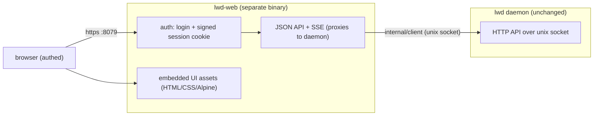

# lwd Phase 5 — web UI (`lwd-web`)

**Status:** Design (decisions taken on recommended defaults; user was away — easy to revise)
**Date:** 2026-07-04
**Builds on:** Phases 1–4 (all merged).

## Goal

A genuinely nice web dashboard for lwd — the "self-hosted Vercel" front door: see
your apps, their domains, status and health at a glance; stream live logs; view
deployment history and roll back with one click; manage secrets; redeploy; and
create/edit an app's config. Built as a **separate web server** (`lwd-web`), not
embedded in the `lwd` daemon.

## Decisions (recommended defaults; user was away)

1. **Frontend: buildless crafted app.** Hand-written modern CSS (cohesive design
   system via CSS custom properties; light/dark) + a small amount of **vendored**
   Alpine.js (embedded, no CDN) for interactivity. **No node toolchain, no Tailwind
   build, no external requests** — fully self-contained and CSP-safe, embedded via
   `go:embed`. The frontend-design skill drives the visual craft. (React/Vite was the
   alternative; rejected to avoid dragging a node build into this Go repo.)
2. **Auth: single admin password → signed session cookie.** Password set via env on
   `lwd-web`; login sets an HMAC-signed, expiring cookie. Constant-time password
   compare. Sufficient for a single-operator tool.
3. **Scope: full dashboard** — overview, per-app detail, live logs (SSE), history +
   rollback, secrets (names only), redeploy, view/edit config.

## Key principle: zero daemon changes

`lwd-web` is **just another client of the daemon's existing unix-socket API** (the
same API the CLI uses). It reuses `internal/client`. No changes to the `lwd` daemon,
reconciler, or API are required — the web server can do nothing the daemon API
doesn't already permit. It exposes its own authenticated HTTP surface to the browser
and translates to daemon calls.

## Architecture

- **`cmd/lwd-web/main.go`** — entrypoint: reads config (env), builds the daemon
  client, starts the HTTP server.
- **`internal/web/server.go`** — routes, middleware, serves embedded assets, mounts
  the browser JSON API + SSE. Depends on a `DaemonClient` interface (below) so
  handlers are testable with a fake.
- **`internal/web/auth.go`** — `POST /login` (password form → constant-time compare →
  signed cookie), session middleware (validates the HMAC cookie + expiry), `POST
  /logout`. Cookie is `HttpOnly`, `SameSite=Lax`, `Secure` when served over TLS.
- **`internal/web/assets/`** — `index.html`, `app.css` (hand-crafted design system),
  `app.js` (+ vendored `alpine.min.js`), `login.html`. Embedded via `go:embed`.
- **`DaemonClient` interface** — the subset of `internal/client` the web layer uses
  (`Apps`, `History`, `Logs`, `Apply`, `Rollback`, `Remove`, `SetSecret`,
  `ListSecrets`, `DeleteSecret`). `*client.Client` satisfies it; a fake drives tests.

## Config (`lwd-web`, via env)

- `LWD_WEB_PASSWORD` (required) — admin password. Refuse to start if unset.
- `LWD_WEB_SECRET` (optional) — cookie signing key; if unset, generate a random key at
  start (sessions reset on restart — acceptable) or persist one under the data dir.
- `LWD_WEB_ADDR` (default `127.0.0.1:8079`) — listen address. Operators can bind
  localhost + SSH-tunnel, or expose it and (ideally) front it with lwd's own Caddy /
  their own TLS.
- `LWD_SOCKET` / `LWD_DATA_DIR` — locate the daemon's unix socket (reuse `internal/config`).

## Browser-facing API (all under `/api`, session-gated)

- `GET /api/apps` → apps overview (name, domain, status, image, health) — from daemon
  `Apps`.
- `GET /api/apps/{name}` → detail: current status + deployment history (daemon
  `History`).
- `GET /api/apps/{name}/logs` → **SSE** stream (daemon `Logs(follow=true)` → SSE
  frames; closes on client disconnect).
- `POST /api/apps/{name}/rollback` → daemon `Rollback`.
- `POST /api/apps/{name}/redeploy` → fetch the current deployment's `Spec` snapshot
  (from `History`), unmarshal to `spec.App`, daemon `Apply`. (Compose apps re-read
  their stored compose path on the daemon host — works since the path is absolute.)
- `POST /api/apply` → body is an `lwd.toml` document (text); parse with `spec.Parse`,
  validate, daemon `Apply`. (Create/edit. Single-service apps work fully from a
  pasted file; compose apps also need their compose file present on the daemon host,
  so paste-create is primarily for single-service — documented.)
- `DELETE /api/apps/{name}` → daemon `Remove`.
- Secrets: `GET /api/apps/{name}/secrets` (names only), `POST` (set from a form field),
  `DELETE /api/apps/{name}/secrets/{key}`.

No endpoint ever returns a secret value (mirrors the daemon guarantee).

## UI (views)

The frontend-design skill produces the actual craft; this is the information design.

- **Login** — a clean single-field password screen.
- **Overview** — a grid of app cards: name, domain (opens the live site), a status pill
  (running / failed / retired), current image tag, a health dot, last-deployed time. A
  prominent **Deploy** action (opens a modal to paste an `lwd.toml`). Live-ish via
  light polling.
- **App detail** — header (name, domain link, status); sections/tabs:
  - **Logs** — live SSE stream with a follow toggle and wrap/scroll.
  - **Deployments** — history table (image digest, status, time) with a **Roll back**
    button per prior deployment; a **Redeploy** action.
  - **Secrets** — list of names, add (name + value, value write-only), delete.
  - **Config** — view/edit the app's `lwd.toml` (from the current spec snapshot) and
    **Apply**.
  - **Danger** — delete the app (confirm).

Design intent: distinctive, polished, fast, legible; light + dark; keyboard-friendly;
no external asset fetches (CSP-safe). Not generic-admin-template aesthetics.

## Error handling

- Missing `LWD_WEB_PASSWORD` → refuse to start with a clear message.
- Daemon socket unreachable → the UI shows a clear "cannot reach lwd daemon" state;
  API returns 502 with a message (never a blank page).
- Unauthed API/page access → 401 / redirect to login.
- Bad `lwd.toml` on apply → 400 with the parse/validate error shown inline.
- SSE disconnect → server stops streaming, cleans up.

## Testing strategy

- **auth**: valid/invalid password (constant-time), cookie sign/verify round-trip,
  tampered/expired cookie rejected, middleware blocks unauthed and allows authed.
- **API handlers**: against a **fake `DaemonClient`** — apps list shape, detail merges
  history, rollback/redeploy/delete call the right client method, apply parses TOML and
  rejects bad input (400), secrets set/list-names/delete (value never in a response).
- **SSE**: fake client emits lines → handler writes SSE frames; disconnect stops it.
- **assets**: `go:embed` includes the files; a smoke test that `/` serves the login/app
  shell and `/api/apps` requires auth.
- **integration (guarded)**: run `lwd-web` against a real daemon on a temp socket
  (fake node stack), log in, hit `/api/apps` — end to end over HTTP. Docker not
  required for the web layer itself.

## Distribution / running

`lwd-web` is a second single binary (assets embedded). Run it on the same host as the
daemon; point a browser at it (localhost, SSH tunnel, or front it with Caddy). Building:
`CGO_ENABLED=0 go build -o lwd-web ./cmd/lwd-web`. README gets an "lwd-web" section.
(Dogfooding note — lwd could later deploy `lwd-web` as one of its own apps; out of
scope now.)

## Out of scope (later)

- Deploy-from-git-repo in the UI (paste-lwd.toml only for now).
- Multi-user / roles (single admin password).
- Full compose-app creation from the UI (needs the compose file on the host).
- The lwd.toml authoring skill (Phase 6) and the MCP (Phase 7).
