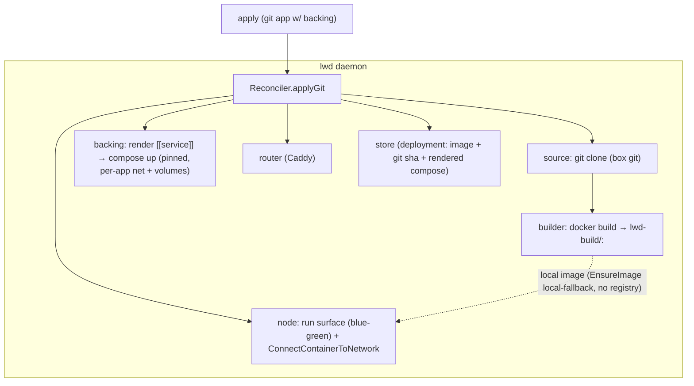

# lwd Phase 6 — git deploy, build-from-source, backing services, web-UI authoring

**Status:** Design (decisions resolved with the user)
**Date:** 2026-07-04
**Builds on:** Phases 1–5 (all merged).

## Goal

Deploy an app straight from a **git repo** — clone with the box's own `git`, build
its Dockerfile, and run it via the existing zero-downtime blue-green path — and let
that app declare **backing services** (Postgres, MinIO, Redis…) that lwd runs as
pinned containers alongside it, even when the repo has no compose file. Plus a web-UI
flow to author an `lwd.toml` (a "from git" form and a builder), not just paste raw TOML.

## Suckless stance (resolved with the user)

Git deploy uses the **box's `git`** (shell out to `git clone`/`git fetch`) and
**`docker build`** — composing existing tools, exactly like lwd already composes
`docker`, `docker compose`, and `caddy`. **No** GitHub/GitLab API, OAuth, or webhook
receiver. Private repos work if the box's git is already authenticated (SSH key /
credential helper); lwd manages no git credentials. This is why git deploy is
suckless-compliant and worth doing.

## Decisions (resolved)

1. **Config model A** — `lwd.toml` stays the source of truth. A `[git]` block supplies
   the build context; lwd clones only to get the source tree. (Not "lwd reads the
   repo's own committed config" — that's a possible follow-up.)
2. **Scope: git + Dockerfile → single-service surface** (blue-green). Deploying a
   repo's *own* `docker-compose.yml` in place is deferred to a fast follow (rollback of
   compose `build:` services from a gone checkout is messy). The Phase 4 user-provided-
   compose app shape is unchanged.
3. **Rollback: tag built images by commit sha and keep them.** Each build →
   `lwd-build/<app>:<shortsha>`; rollback redeploys the prior tag (instant, no rebuild,
   reuses the existing image-based rollback). Costs some local disk for old layers.
4. **Backing services** (Postgres/MinIO/etc.) are declarable in `lwd.toml` and run as
   **pinned** containers via a generated compose project — required to make git/single-
   service apps actually useful.
5. Build mechanism: shell out to **`docker build`** (buildx if present). UI: Deploy
   modal gets **From Git**, **Builder**, and **Paste** tabs.

## App shapes (after this phase)

1. Single **image** app (Phases 1–2) — blue-green. *(may now also declare backing)*
2. **Compose** app (Phase 4) — user-provided compose, whole stack in-place. *(unchanged)*
3. **Git-built** app (Phase 6) — `[git]` + `[build]` → blue-green surface. *(may declare backing)*
4. Any surface app (#1 or #3) may declare **`[[service]]` backing services** → pinned.

## Config

A git-built app with backing services:

```toml
name   = "myapp"
domain = "myapp.example.com"
port   = 8080
env    = { DATABASE_URL = "postgres://app:app@db:5432/app", S3_ENDPOINT = "http://minio:9000" }
secrets = ["SECRET_KEY"]

[git]
url = "https://github.com/me/myapp"
ref = "main"          # branch, tag, or sha; branch → latest on deploy
# path = "."          # subdir within the repo (build context root)

[build]
dockerfile = "Dockerfile"   # relative to git path
# context = "."

[[service]]                  # pinned backing service
name   = "db"
image  = "postgres:16"
env    = { POSTGRES_USER = "app", POSTGRES_PASSWORD = "app", POSTGRES_DB = "app" }
volume = "db-data:/var/lib/postgresql/data"

[[service]]
name    = "minio"
image   = "minio/minio"
command = "server /data"
env     = { MINIO_ROOT_USER = "admin" }
secrets = ["MINIO_ROOT_PASSWORD"]        # injected into the backing service too
volume  = "minio-data:/data"
```

Validation: `[git]` requires `url` and a `[build]` (Dockerfile). A git app must not set
`image` or `compose`. `[[service]]` entries require `name` + `image`; allowed on image
and git-built apps, **not** on Phase-4 `compose` apps (those already define their whole
stack). `[[service]]` names must be unique and DNS-safe.

## Architecture



- **`internal/source`** — `git` client (shell out): `Clone(ctx, url, ref, dir) (sha string, err error)` (shallow clone of ref, returns resolved commit sha), tolerant of branch/tag/sha refs. Fake for tests.
- **`internal/build`** — `docker build` wrapper: `Build(ctx, contextDir, dockerfile, tag string, buildArgs map[string]string) error` (shell out `docker build -t <tag> -f <dockerfile> <context>`), stderr surfaced. Fake for tests.
- **Backing services** — reuse Phase 4's `compose` package: lwd renders `[[service]]`
  into a generated `docker-compose` YAML (services with image/env/command/volumes on a
  per-app network `lwd-<app>`), writes it to a work file, and `compose.Up` (pinned).
  Named volumes persist data; unchanged services aren't recreated (compose semantics).
- **Reconciler** — new `applyGit` path (and backing handling for image apps too). `New`
  gains `source.Git` + `build.Builder` deps. `Apply` branches: `[git]` → applyGit; else
  existing image/compose paths — all of which now also ensure declared backing services.
- **Store** — deployment records already store `Spec` + `Compose`; add the resolved
  **git sha** and the **built image tag** so rollback redeploys the exact prior image,
  and the generated backing-compose content (reuse the `Compose` column).
- **Web UI** — Deploy modal tabs: **From Git** (url/ref/subdir, name/domain/port,
  Dockerfile, + add backing services) → builds an `lwd.toml` and applies; **Builder**
  (image or git, domain/port/env/secrets/backing) → `lwd.toml`; **Paste** (existing).

## Deploy flow (`applyGit`)

1. Validate (git shape + backing).
2. `router.EnsureUp`; ensure the `lwd` network and the per-app backing network.
3. Resolve secrets (fail-closed) → env for surface and backing.
4. **Backing first:** render `[[service]]` → compose YAML → `compose.Up(project=lwd-<app>, ...)`
   on the per-app network (pinned; volumes persist; unchanged services not recreated).
5. **Source:** `git clone` the ref into a temp work dir → resolved `sha`.
6. **Build:** `docker build -t lwd-build/<app>:<sha> <context>` (skip if that tag already
   exists locally — idempotent redeploys of the same sha).
7. **Deploy surface (blue-green):** run `lwd-build/<app>:<sha>` via the Node path; connect
   the new surface container to both the `lwd` network (Caddy) and the per-app backing
   network (reaches `db`, `minio` by name); health-check through Caddy; flip the route;
   retire the old surface. (EnsureImage's local-fallback means the locally-built image
   needs no registry.)
8. Record the deployment (image tag, git sha, rendered backing compose). Remove the temp
   clone.

**Backing services are pinned** — never blue-greened, and **not** torn down on surface
redeploy or rollback (data safety, the whole point).

## Rollback / remove

- **Rollback** (git-built): redeploy the previous deployment's built image tag
  (`lwd-build/<app>:<oldsha>`, still local) — no re-clone, no rebuild. Backing untouched.
- **Remove** (`lwd rm`): stop/remove the surface + `compose.Down` the backing project
  (this DOES remove backing containers; named volumes remain unless pruned — data is not
  auto-destroyed). Remove the Caddy route + retire.

## Error handling

- Missing `git` or `docker build` on the host → clear error on first git deploy (not at
  daemon start).
- Clone failure (bad url/ref/auth) → surfaced with git's stderr; deploy aborts before
  build. Build failure → git's/docker's stderr surfaced; surface not swapped (old keeps
  serving — blue-green).
- Backing `compose up` failure → abort before building/swapping the surface.
- Fail-closed secrets before any clone/build/compose.

## Testing strategy

- `source` (git) + `build` (docker build) behind interfaces with fakes → `applyGit` is
  unit-testable with no network/Docker (fake clone returns a sha; fake build records the
  tag). Real paths covered by a guarded e2e.
- Reconciler: applyGit ordering (backing up → clone → build → surface blue-green →
  connect both networks → route → health); fail-closed; backing pinned (not torn down on
  redeploy); rollback redeploys prior tag without rebuild; backing-service rendering
  (name/image/env/volume → compose yaml) is a pure, unit-tested function.
- Web UI: From-Git + Builder forms produce a valid `lwd.toml` (the generated toml parses
  + validates); backing-service rows add/remove; apply round-trip.
- e2e (guarded by `LWD_DOCKER_TEST`, needs git + docker build + compose): deploy a tiny
  real git repo (a Dockerfile app) with a Postgres backing service → assert the app is
  reachable through Caddy AND can reach Postgres; redeploy → Postgres container id
  unchanged (pinned); rollback → prior image redeployed; rm → stack down.

## Out of scope (later)

- Repo-defines-itself (Model B: read the repo's own `lwd.toml`).
- Deploying a repo's own `docker-compose.yml` in place (git + repo-compose).
- Auto-redeploy on push (a git-hook/poll is the operator's policy; lwd stays manual-trigger).
- Registry push of built images (local image is enough single-host); multi-node.
- Phase 7 (lwd.toml authoring skill), Phase 8 (local MCP).
