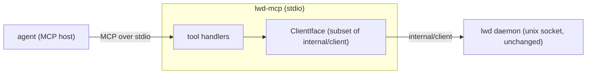

# lwd Phase 8 — local MCP server (`lwd-mcp`)

**Status:** Design (decisions resolved with the user)
**Date:** 2026-07-04
**Builds on:** Phases 1–7 (all merged).

## Goal

Let an agent session drive lwd directly: deploy (from a dir, raw toml, or a git repo),
roll back, read logs/history/status, and manage secrets — via MCP tools. Box-local,
stdio transport, no new network API. The MCP server is just another client of the
daemon's existing unix socket (reuse `internal/client`), the same trust as the CLI.

## Decisions (resolved)

1. **Language: Go**, `cmd/lwd-mcp`, reusing `internal/client` + `internal/spec`. Single
   static binary, no new runtime.
2. **SDK: official `modelcontextprotocol/go-sdk`** (the one new dependency, `cmd/lwd-mcp`/`internal/mcp` only).
3. **Transport: stdio** — an agent launches `lwd-mcp`; no listener, no auth (stdio-local
   = CLI trust; the daemon socket is `0600`).
4. **Tool surface: full** — reads + deploy/rollback/remove/secrets.
5. **Destructive guard: MCP annotations + host approval** — mark read tools
   `readOnlyHint`, mutating tools with a `destructiveHint` where apt; rely on the MCP
   host's per-call approval prompt (no custom `confirm` arg).

## Architecture

- **`cmd/lwd-mcp/main.go`** — build the daemon client (`client.New(config.SocketPath())`),
  construct the MCP server (go-sdk), register tools, serve over stdio.
- **`internal/mcp/server.go`** — `ClientIface` (the subset of `*client.Client` the tools
  use: Apps, History, Logs, Apply, Rollback, Remove, SetSecret, ListSecrets,
  DeleteSecret; `*client.Client` satisfies it via a compile-time assertion), tool
  registration, and a fake for tests.
- **`internal/mcp/tools.go`** — the tool handlers.
- Zero daemon changes.

## Tools

Read (annotate `readOnlyHint: true`):
- `lwd_list` → `Apps` → apps overview (name, domain, status, image, health).
- `lwd_status` (name) → the app's current status + latest deployments (from `History`).
- `lwd_logs` (name, tail?) → recent container logs (call `Logs(follow=false)`, capture to
  a string; `tail` caps lines).
- `lwd_history` (name) → deployment history (image, status, time).

Mutating (host prompts on each call; annotate `destructiveHint` on remove):
- `lwd_apply` (dir? | toml?) → `spec.Load(dir)` or `spec.Parse(toml)` → `Validate` →
  `Apply`. Returns the deployment.
- `lwd_deploy_git` (url, ref?, dockerfile?, name, domain, port, services?) → construct a
  git `spec.App` (`[git]`+`[build]`, optional `[[services]]`), Validate, `Apply`.
- `lwd_rollback` (name) → `Rollback`.
- `lwd_remove` (name) → `Remove` (`destructiveHint: true`).
- `lwd_secret_set` (app, key, value) → `SetSecret`. (Value is provided by the caller; it
  transits the local socket only — never returned by any tool.)
- `lwd_secret_list` (app) → `ListSecrets` (names only).
- `lwd_secret_delete` (app, key) → `DeleteSecret`.

Each tool has a JSON-schema for args (go-sdk), a clear description, and returns concise
structured text (JSON or a formatted summary). Errors from the daemon are surfaced as
tool errors with the daemon's message. No secret VALUE is ever returned.

## Error handling

- Daemon socket unreachable → each tool returns a clear "cannot reach lwd daemon at
  <socket>; is `lwd daemon` running?" error (not a crash).
- Bad `lwd_apply` toml / invalid spec → the validation error as a tool error.
- Unknown app → the daemon's 404 surfaced.

## Testing strategy

- Handlers tested against a **fake `ClientIface`** (mirrors the web layer's approach):
  each tool calls the right client method with the right args; `lwd_apply` parses+validates
  toml (bad toml → error); `lwd_deploy_git` builds a valid git spec; no secret value in
  any tool's output; read tools annotated read-only.
- A server-construction smoke test (tools registered with schemas; `*client.Client`
  satisfies `ClientIface` — compile assertion).
- Integration (guarded): run `lwd-mcp` over stdio against a real daemon `api.Server` on a
  temp socket (fake node stack, no Docker) — initialize, `tools/list`, call `lwd_list` and
  `lwd_apply` (single-service toml), assert results. (Reuses the fake-daemon harness from
  the web integration test.)

## Distribution / usage

`lwd-mcp` is a third single binary (`CGO_ENABLED=0 go build -o lwd-mcp ./cmd/lwd-mcp`).
README documents registering it with an MCP host (a `claude` / MCP config snippet:
command `lwd-mcp`, transport stdio, env `LWD_DATA_DIR`/`LWD_SOCKET` to locate the daemon).
Requires the `lwd daemon` running on the same box.

## Out of scope (later)

- Remote/networked MCP (HTTP/SSE transport) + auth — stdio-local only for now.
- Multi-node targeting (Phase 9 swarm).
- Exposing web-only concerns.

## Note on Phase 9

After this, Phase 9 (swarm / multi-node federation) is the next scope — the `Node`
interface, image-as-precondition, and node-in-schema seams were built for it since
Phase 1. Not part of Phase 8.
