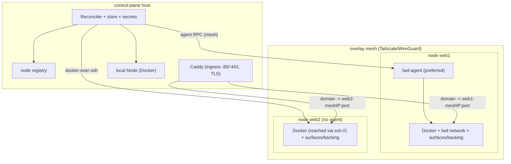

# lwd Phase 9 — federation foundation (v2)

**Status:** Design (decisions resolved; SPEC FOR REVIEW — not yet planned/built)
**Date:** 2026-07-05
**Builds on:** Phases 1–8 (all merged).
**North star:** `docs/VISION.md` — this is **P9**, the first increment of the lwd v2
program (P9 federation → P10 continuous reconciler → P11 scheduler → P12 replicas →
P13 multi-edge → P14 resource drivers → P15 resource HA). It deliberately does the
*smallest useful multi-node step* and leaves the continuous loop, scheduler, replicas,
multi-edge, and resource drivers to later phases. Guardrail: extend Node/Router/
Reconciler/Store; the agent stays **dumb**; each subsystem must simplify UX.

## Goal

Manage deployments across a small cluster: register several hosts as **nodes**, place
apps on a chosen node (`node = "web1"`), and have the one control-plane lwd daemon
deploy/route/roll back apps on any node — reusing everything built so far. No
autoscaler, no gossip/raft; explicit placement, lightweight.

This is the payoff of the seams laid since Phase 1: the `Node` interface (one `local`
impl today), image-as-precondition ("ensure this image is present on the node"), and
the `node` field on every app (always `local` until now).

## Decisions (resolved)

1. **Topology: one control-plane daemon + nodes.** The control daemon keeps the store,
   reconciler, router config, and secrets; it drives each node through a `Node` impl.
   No per-node consensus.
2. **Transport: agent-if-available, else SSH.** Each node has a `Node` impl chosen per
   node: prefer a **dumb `lwd-agent`** (a new small binary on the node exposing the Node
   *primitives* over an authenticated HTTP RPC on the mesh — execute Docker ops, report
   health + capacity, stream logs, execute deployments; **nothing more**); **fall back
   to docker-over-SSH** (`ssh://user@host` via the Docker SDK's ssh conn-helper — no
   agent needed). Selection is automatic: agent if reachable+authorized, else SSH. The
   **controller** decides *what* to run; the agent only *executes* — no orchestration/
   build/scheduling logic lives in the agent (per the VISION guardrail).
3. **Images: `docker save | ssh | docker load` (no registry).** `EnsureImage` on a
   remote node ships a locally-built/pulled image over the transport; registry pull is
   used when the ref is a registry image. No registry infrastructure required.
4. **Routing: WireGuard mesh → central Caddy (P9); multi-edge is P13.** All nodes join
   an operator-run WireGuard mesh. Remote surfaces publish an ephemeral port bound to
   the node's **mesh address**; the control-host Caddy proxies `domain →
   <nodeMeshIP>:<port>`. Local surfaces keep the current no-host-port + `lwd`-network
   model. One ingress, one TLS setup, blue-green preserved (swap the Caddy upstream to
   the new node/port). P9 ships a **single central Caddy**; the N-edge + DNS-round-robin
   end state (VISION decision 3) arrives in **P13** — the P9 Router abstraction is built
   so multi-edge is an extension, not a rewrite.
5. **Placement: explicit** via `node = "<name>"` (default `local`). No scheduler.
6. **Review gate:** this spec is presented for review before any plan/build.

## Architecture

## Components

- **Node registry** (`internal/store` + CLI/API): `Node{Name, SSHTarget, AgentURL?,
  MeshAddr, AddedAt}`. `lwd node add <name> ssh://user@host [--agent https://host:PORT]
  [--mesh <meshIP-or-host>]`, `lwd node ls` (name, transport-in-use, reachability),
  `lwd node rm <name>`. The `local` node is implicit/always present.
- **Node impls** (behind the existing `node.Node` interface):
  - `localDocker` — unchanged (the control host itself).
  - `sshDocker` — `client.NewClientWithOpts(client.WithHost("ssh://user@host"),
    WithAPIVersionNegotiation())`; all existing Node ops work against the remote Docker.
  - `agentNode` — HTTP client to `lwd-agent`'s RPC (same Node op set); preferred.
  - A **resolver** picks per node: agentNode if `AgentURL` set and a health ping
    succeeds, else sshDocker. Cached with periodic re-check.
- **`cmd/lwd-agent`** (new binary, **dumb**): runs on a node, binds its mesh address,
  exposes the Node *primitives* (EnsureImage, RunContainer, RemoveContainer,
  ListContainers, ContainerLogs, Health, EnsureNetwork, ConnectContainerToNetwork,
  ContainerHealth) + a health/capacity report + an image `load` stream endpoint, over an
  **authenticated** HTTP API (shared bearer token `LWD_AGENT_TOKEN`), talking to the
  node's local Docker. It contains **no** build/compose/scheduling logic — it executes
  what the controller tells it. Single static binary, `scp`'d to each node.
- **Build stays on the controller.** Git build (Phase 6) runs on the control host as
  today, producing `lwd-build/<app>:<sha>`; the image is then shipped to the target node
  via save|load. (This keeps the agent dumb and Phase 6 unchanged. A node-local builder
  is a possible later optimization, not P9.)
- **Image movement**: `EnsureImage(node, ref)` — registry image → pull on the node;
  local/built image absent on the node → `docker save ref | <transport> docker load`
  (agent: stream to the load endpoint; ssh: `docker save | ssh host docker load`).
  Idempotent (skip if present).
- **Reconciler**: same flow, resolves `app.Node` → the right `Node` impl;
  `EnsureImage`/`RunContainer`/`ConnectContainerToNetwork`/health target that node.
  **Remote backing services (P9):** driven by the controller via docker-over-ssh
  `docker compose` against the node's Docker (co-located with the surface) — the current
  generated-compose backing, just pointed at the remote daemon. (P14's resource drivers
  supersede compose-backing; P9 does not put compose logic in the agent.)
- **Router**: for a `local` surface, upstream = container on the `lwd` network (as now);
  for a **remote** surface, lwd tells the node to publish the surface's port on the
  node's **mesh address** (ephemeral), and sets the Caddy upstream to
  `<nodeMeshAddr>:<ephemeralPort>`. Blue-green: new container → new ephemeral port →
  probe (through Caddy staging as today, now reaching the mesh addr) → flip upstream →
  retire old.
- **Web UI / MCP**: a node column/field; deploy targets a node; otherwise unchanged.

## Scope boundaries

- **Backing services are co-located with their surface** on the same node (a surface on
  web1 reaches its db on web1's local `lwd` network). Cross-node backing (app on A, db
  on B) is **out of scope** — declare backing on the app's node.
- **No autoscaling / no automatic failover / no rescheduling** on node loss. If a node
  is down, its apps are down; the operator re-places or fixes the node. (Explicitly
  lightweight; failover is a later phase if wanted.)
- **The operator runs the mesh** (Tailscale/WireGuard) and ensures node↔control and
  node mesh addresses. lwd does not manage the mesh (compose the box's tools — suckless).
- **Secrets** stay on the control plane and are injected at deploy to the target node
  the same way (values flow to the node over the authenticated transport at run time,
  never persisted on the node beyond the container env).

## Security

- **Agent RPC**: bearer token (`LWD_AGENT_TOKEN`, shared control↔agent), bound to the
  mesh interface only (never public); mesh provides network isolation + encryption.
- **SSH**: the box's ssh auth (keys); lwd manages no ssh credentials.
- **Image load / build streams** carry image layers (not secrets); secret values reach
  the node only as container env at `RunContainer` time over the authenticated transport.
- Reuse Phase-6 validation (git url/ref/path, secret-name identifiers) — federation
  changes the *where*, not the *what*, of a deploy.

## Error handling

- Node unreachable (agent ping fails AND ssh fails) → deploy to that node aborts with a
  clear error; existing deployments on reachable nodes are unaffected.
- Agent auth failure → clear error; fall back to SSH only if SSH is configured, else fail.
- Image save|load failure → surfaced; surface not swapped (blue-green isolation holds).

## Testing strategy

- Node impls behind `node.Node` → the reconciler is unit-tested with a fake multi-node
  setup (a map of fake nodes) exactly as today; placement routes to the right fake node.
- `sshDocker`/`agentNode` are integration-tested (guarded): a real `lwd-agent` on
  localhost (loopback "remote") + a docker-over-ssh to `ssh://localhost` if available.
- `lwd-agent` RPC: unit-test the handlers against a fake local Docker (reuse the Node
  fake); auth (token required); image-load streaming.
- Router remote-upstream: unit-test that a remote surface yields a `meshAddr:port`
  Caddy upstream; local stays container-name.
- e2e (guarded, needs 2 Docker contexts or an agent on loopback): deploy an app to a
  "remote" node, assert it's reachable through the control Caddy via the node's addr,
  redeploy (blue-green), roll back, and that a `local` app still works.

## Decomposition (when we plan P9)

Likely two implementation slices:
- **9a — node registry + transports (ssh first, then agent) + image save|load +
  explicit `node=` placement + remote surface reachable via the node's mesh address +
  central Caddy upstream to it.** Gets multi-node deploys working end to end.
- **9b — `lwd-agent` (dumb) as the preferred transport + capacity/health reporting +
  web/MCP node UX (`lwd node add/ls/rm`, node column) + cross-node e2e.**
(Final split decided in writing-plans.)

## Resolved by the v2 vision (see docs/VISION.md)

- Routing model: WireGuard mesh + central Caddy in P9; **N edges + DNS round-robin is
  the end state (P13)** — not built here.
- Agent is **dumb** (no build/compose/scheduling); controller drives; build on the
  controller then save|load.
- Continuous reconciliation + surface failover, scheduler/capacity/pools, replica
  scaling, and first-class resource drivers/HA are **later phases (P10–P15)**, not P9.
  P9 keeps explicit `node=` placement and apply-time reconciliation.

## Review

This spec is presented for review before writing the P9 implementation plan. Open point
worth a sanity check: the "remote surface publishes an ephemeral port on the node's
WireGuard address, central Caddy proxies to it" mechanism (vs. anything fancier) —
confirm it fits the intended network before we build.
